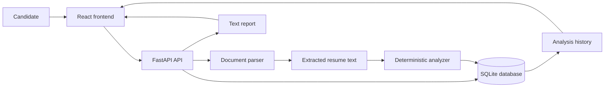
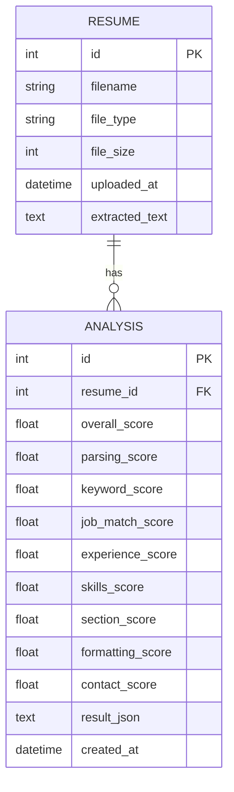
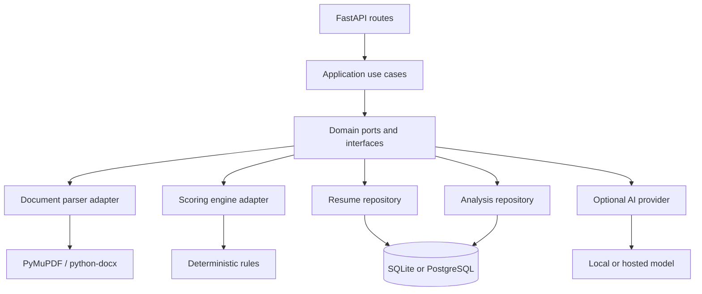
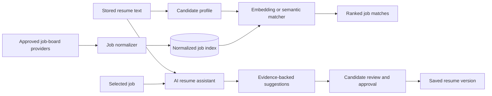

# ATS Resume Analyzer

ATS Resume Analyzer is a local-first application that helps candidates understand how clearly their resume can be parsed and how closely it matches a target job description. It accepts PDF and DOCX files, extracts their text, calculates a transparent compatibility score, stores analysis history in SQLite, and exports a text report.

The application currently uses deterministic rules. Its score is an explainable signal, not an employer's score, a vendor score, or a guarantee of an interview.

## Product Direction

The project is designed to grow from a resume checker into a private career assistant:

1. Analyze the resume structure, skills, experience, and contact information.
2. Compare the resume with a job description.
3. Explain missing or weak signals and suggest truthful improvements.
4. Discover relevant job posts from approved job-board integrations.
5. Rank jobs by skill fit, experience fit, location, seniority, and preferences.
6. Use an optional AI model to rewrite suggestions, generate tailored variants, and explain job matches.

The first four steps are the current architectural foundation. Job discovery and AI assistance are planned capabilities described below.

## Current Features

- PDF and DOCX validation using extension, MIME type, file signature, and a 10 MB limit
- In-memory document parsing with PyMuPDF and python-docx
- Deterministic scoring for parsing, keywords, job match, experience, skills, sections, formatting, and contact details
- Explainable issues and recommendations
- Local SQLite persistence for resumes and analysis history
- Analysis deletion and plain-text report export
- React dashboard with overview, upload, result, history, settings, and interactive 3D signal visualization
- Unit tests for the scoring engine

## Architecture Today

The current system is a modular monolith with two deployable applications:

- **Frontend:** Vite, React, TypeScript, React Router, and a small API client
- **Backend:** FastAPI, Pydantic, SQLAlchemy, and SQLite
- **Document services:** isolated parser and deterministic analyzer modules
- **Persistence:** `Resume` and `Analysis` SQLAlchemy models, with extracted text and serialized result data

### Request Flow



### Backend Module Responsibilities

| Module | Responsibility |
| --- | --- |
| `app/main.py` | HTTP routes, dependency injection, request orchestration, and response mapping |
| `app/schemas.py` | API input and output contracts |
| `app/models.py` | SQLAlchemy persistence models and relationships |
| `app/database.py` | Engine, session, and declarative base setup |
| `app/services/document_parser.py` | File validation and PDF/DOCX text extraction |
| `app/services/analyzer.py` | Pure scoring rules, keyword matching, issue detection, and recommendations |
| `frontend/src/api.ts` | Typed frontend-to-backend requests |
| `frontend/src/App.tsx` | Routes, page composition, and workflow state |
| `frontend/src/components/SignalOrb.tsx` | Isolated interactive visual component with reduced-motion support |

### Data Schema



## Architecture Refactor

The current code is intentionally small, but `main.py` currently combines routing, orchestration, persistence mapping, and report formatting. The next refactor should preserve the public API while separating these responsibilities into application use cases and infrastructure adapters.

### Target Layers



Suggested target structure:

```text
backend/app/
  domain/
    entities.py
    value_objects.py
    ports.py
  application/
    analyze_resume.py
    upload_resume.py
    recommend_jobs.py
    improve_resume.py
  infrastructure/
    persistence/
      repositories.py
    documents/
      parser.py
    scoring/
      deterministic.py
    ai/
      provider.py
      local_provider.py
      hosted_provider.py
    jobs/
      providers.py
  presentation/
    http/
      routes.py
      schemas.py
```

### SOLID Application

- **Single Responsibility:** keep parsing, scoring, persistence, report generation, AI prompting, and job retrieval in separate services.
- **Open/Closed:** add scoring strategies and job providers through interfaces rather than editing the route layer.
- **Liskov Substitution:** deterministic and AI-assisted analyzers must return the same analysis contract and remain interchangeable.
- **Interface Segregation:** use small ports such as `ResumeRepository`, `JobProvider`, `ScoringEngine`, and `AIImprovementProvider` instead of one large service interface.
- **Dependency Inversion:** application use cases depend on ports; SQLite, job-board APIs, and model SDKs are injected infrastructure implementations.

This refactor should be incremental. First extract use cases from `main.py`, then move repository access behind ports, and only then add external job providers or model integrations.

## Planned AI Resume Assistant

The planned assistant should improve a resume without inventing experience. It should produce suggestions with evidence from the source document and clearly label generated text.

### Planned Capabilities

- Semantic resume-to-job matching beyond exact keyword overlap
- Skill extraction grouped into technical skills, tools, domain skills, and transferable skills
- Missing-skill explanations with confidence and evidence from the job description
- Resume improvement suggestions for summaries, bullet points, measurable outcomes, and ordering
- Tailored resume variants for a selected job, with user approval before saving
- Cover-letter and interview-question drafts based on the selected resume and job
- Job recommendations ranked by skill fit, experience level, location, work mode, and user preferences
- Feedback on why a job was recommended and which skills could improve the match

### AI and Job-Matching Flow



### Proposed AI Ports

```python
class AIImprovementProvider(Protocol):
    def suggest_improvements(self, resume_text: str, job_description: str) -> ImprovementResult: ...


class JobProvider(Protocol):
    def search(self, query: JobSearchQuery) -> list[JobPosting]: ...


class SemanticMatcher(Protocol):
    def rank(self, candidate: CandidateProfile, jobs: list[JobPosting]) -> list[JobMatch]: ...
```

The concrete provider can be a local model or a hosted model. The application should not depend directly on an SDK, which keeps tests deterministic and makes provider replacement possible.

### Privacy and Safety Requirements

- Keep deterministic analysis available when no model is configured.
- Make external model use opt-in and disclose where resume data is sent.
- Never fabricate skills, employers, dates, degrees, metrics, or responsibilities.
- Show the source text or job requirement behind each generated suggestion.
- Require user approval before writing a generated resume version.
- Store model name, prompt version, and analysis version for reproducibility.
- Encrypt or minimize sensitive data when external providers are enabled.
- Respect job-board terms, robots policies, rate limits, and official APIs; do not scrape restricted sites.

## API Surface

Current endpoints:

| Method | Endpoint | Purpose |
| --- | --- | --- |
| `GET` | `/api/health` | Service health check |
| `POST` | `/api/resumes/upload` | Validate, parse, and store a resume |
| `POST` | `/api/analyses` | Analyze a resume against an optional job description |
| `GET` | `/api/analyses` | List analysis history |
| `GET` | `/api/analyses/{id}` | Fetch one analysis |
| `DELETE` | `/api/analyses/{id}` | Delete one analysis |
| `GET` | `/api/analyses/{id}/report` | Download a text report |

Future endpoints should be added behind separate use cases, for example:

```text
POST /api/resumes/{id}/improvements
POST /api/jobs/search
GET  /api/jobs/recommendations
POST /api/resume-versions
```

## Quick Start

### Docker

```bash
docker compose up --build
```

Open `http://localhost:5173`. API documentation is available at `http://localhost:8000/docs`.

### Local Development

Backend:

```bash
cd backend
python -m venv .venv
.venv\Scripts\activate
pip install -r requirements.txt
uvicorn app.main:app --reload
```

For backend tests, install `requirements-dev.txt` and run:

```bash
pytest
```

In a separate terminal:

```bash
cd frontend
npm install
npm run dev
```

The frontend development server proxies `/api` requests to `http://localhost:8000`.

## Project Structure

```text
backend/
  app/
    config.py
    database.py
    main.py
    models.py
    schemas.py
    services/
      analyzer.py
      document_parser.py
  tests/
frontend/
  src/
    api.ts
    App.tsx
    components/
      SignalOrb.tsx
    styles.css
    styles-enhanced.css
    types.ts
docker-compose.yml
```

Uploaded binary documents are processed in memory. Extracted text and analysis results are stored locally to support history.

## Roadmap

1. Extract backend use cases and repository ports while preserving current endpoints.
2. Add analyzer versioning, richer skill taxonomy, and stronger semantic matching.
3. Add official job-board provider adapters and normalized job records.
4. Add opt-in AI improvement suggestions with evidence and approval workflows.
5. Add semantic job ranking, saved searches, tailored resume versions, and evaluation metrics.
6. Add authentication, encrypted storage, retention controls, and production observability before multi-user deployment.

## Current Limitations

- Keyword equivalence is dictionary-based and is not yet semantic.
- Scanned PDFs without a text layer are rejected; OCR is not implemented.
- Reports are plain text.
- There is no job-board integration or AI model in the current release.
- The current SQLite setup is intended for local use rather than concurrent production workloads.
